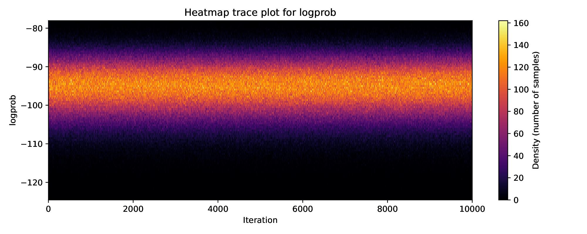

# MCMC diagnostics executable 

The executable is `diagnose_mcmc`, and as minimum it takes the folder location of your MCMC chains to diagnose. The script will look inside of the folder, find all the `.root` files and run diagnostics using all of them. More than one MCMC file is needed for the diagnostics to work.

For help, simply run

```bash
./diagnose_mcmc --help
```

## Best practices for diagnostics

The MCMC diagnostics should always be run in two stages, whether running on `Stan`, `Aria` or `MaCh3` (experimental) MCMC chains:

## 1. Find the appropriate burn-in

The line below will generate trace-plots for identifying the appropriate burn-in burn-in.

```bash
./diagnose_mcmc --traces /location/of/your/chains
```

This will generate `trace_plots.pdf`, with a plot for each of the oscillation and systematic parameters. Each plot is effectively a trace heatmap, with all the chains overlaid on top of each other for that parameter.



Sufficient amount of MCMC steps should be removed from each chain to avoid biasing the results.

Good practice is to remove **more**  MCMC steps than what the burn-in indicates (I normally remove least ~1.5x more than what plot would indicate):
1. Ensures that we take into the account e.g. *2D correlations*.
2. In complex posteriors (bimodalities, non-linear correlations) the 1D "position" might look correct, but it won't be when looking in 2D. E.g. th23-dcp in lower octant.
3. If you are afraid that removing e.g. 50% of your chain might severely decrease the statistics of your posterior **then you need to run more MCMC steps**.

## 2. Post-burn-in diagnostics

To generate all the diagnostics after burn-in is removed, run:

```bash
./diagnose_mcmc --burn-in 100000 /location/of/your/chains
```